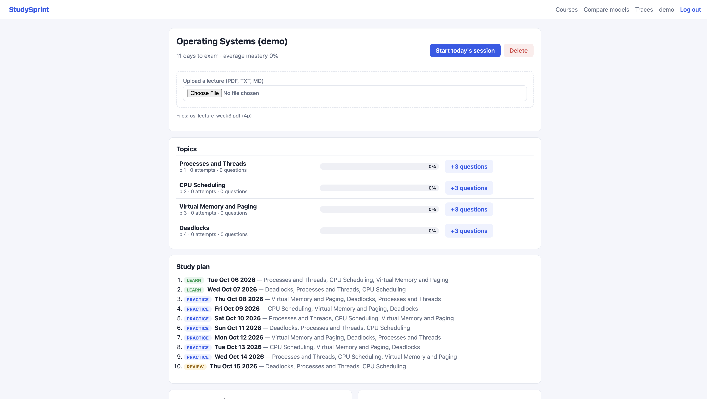
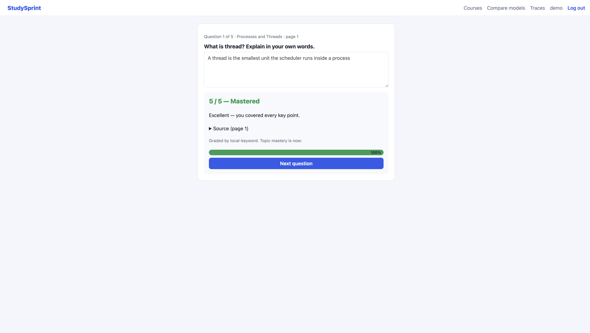
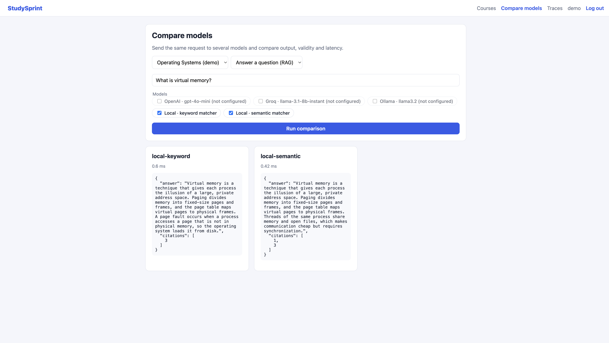
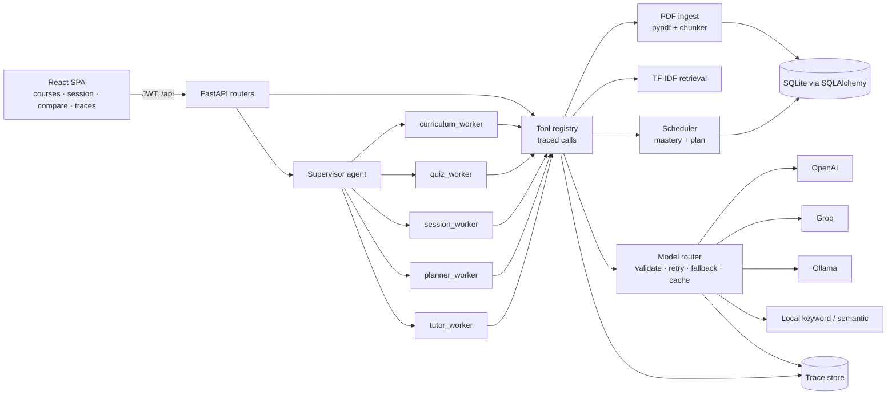

# StudySprint

Upload your lecture PDFs and set an exam date. StudySprint's agents split the material into topics, write page-cited questions, grade your free-text answers against the source, and keep your weakest topics coming back until exam day.

Phase 3 project for the Arbisoft AI-Focused Internship 2026 ([proposal](../docs/PHASE3_PROPOSAL.md)). It is a separate product from the Weeks 1–5 NotesLab practice app.

| Course + plan | Graded answer | Model comparison |
|---|---|---|
|  |  |  |

## Quick start (local)

```bash
# backend (http://localhost:8000, docs at /docs)
cd studysprint/backend
python3.12 -m venv .venv && source .venv/bin/activate
pip install -r requirements-dev.txt
cp .env.example .env          # optional: add OPENAI_API_KEY / GROQ_API_KEY / OLLAMA_BASE_URL
uvicorn app.main:app --reload

# frontend (http://localhost:5173, proxies /api to :8000)
cd studysprint/frontend
npm install
npm run dev
```

Log in with **demo / demopass123**. That account is seeded with an "Operating Systems (demo)" course built from `sample_data/os-lecture-week3.pdf`. No API keys are needed: without them, every AI task runs on the built-in offline models.

## Run with Docker

```bash
cd studysprint
docker compose up --build      # http://localhost:8000 serves both the UI and the API
```

The image builds the React app and serves it from FastAPI, so one container is the whole product. SQLite is kept in the `studysprint-data` volume. For a local LLM, run `docker compose --profile ollama up` and set `OLLAMA_BASE_URL=http://ollama:11434/v1`.

## Deploy (Render, free tier)

1. Push this repo to GitHub.
2. On [Render](https://render.com), choose **New → Blueprint** and select the repo. It picks up [`render.yaml`](../render.yaml) and builds `studysprint/Dockerfile`.
3. Optionally set `OPENAI_API_KEY` / `GROQ_API_KEY` in the service's environment. Without them, the offline models are used.
4. Open the service URL and log in with `demo / demopass123`.

On the free tier, SQLite lives in `/tmp`, so data resets on redeploy. The demo course is re-seeded on every boot.

**Deployed URL:** _add after deploying_ · **Demo video:** _add the Google Drive link_

## Architecture



**How a study loop runs**

1. **Upload:** `ingest_document` extracts text per page, chunks it, and calls `extract_topics`.
2. **Questions:** `generate_questions` retrieves the topic's passages and asks a model for `{prompt, reference_answer, key_points, source_page}`.
3. **Session:** `build_session` ranks topics by priority (never practiced, then low mastery, then longest since last practice) and picks the least-recently-answered question from each.
4. **Grading:** `grade_answer` sends the answer, the reference and the key points to a model. It returns `{score 0–5, feedback, missing_points}`, and `update_mastery` blends the score into the topic.
5. **Plan:** `plan_sessions` simulates practice day by day up to the exam, ending with a review day for the weakest topics.
6. **Ask (secondary feature, RAG):** `answer_question` answers only from retrieved passages and returns page citations.

**AI features at a glance**

| Feature | Agent primitive | Where |
|---|---|---|
| Topic mapping from PDFs | Curriculum worker + `extract_topics` tool, structured output | `ai/tools.py`, `ai/agents.py` |
| Page-cited question writing | Quiz worker + retrieval + `generate_questions` | `ai/tools.py` |
| Free-text grading | `grade_answer` with schema + grade guard | `ai/tools.py`, `ai/outputs.py` |
| Adaptive schedule | Mastery memory + `plan_sessions` / `build_session` | `services/scheduler.py` |
| Ask your material (RAG) | Tutor worker + `answer_question`, page citations | `ai/tools.py` |
| Goal-driven agent | Supervisor routes a goal to an intent and a worker pipeline | `ai/agents.py` |
| Multi-model comparison | Router `compare()` across providers | `ai/router.py` |

**AI safety rails in the model router**

- Every model output is validated against a Pydantic schema (`app/ai/outputs.py`).
- Semantic guards reject cited pages that don't exist and inconsistent grades (a 5 that still lists missing points, or a 0 with nothing missing).
- An invalid output gets one retry with the validation error fed back to the model. The router then falls back to the next model, and `local-keyword` always works.
- Results are cached with an LRU cache keyed on task, model and payload. Every attempt is traced.

### Code map

| Path | What |
|---|---|
| `backend/app/ai/router.py` | Model client router: priority chain, retry, fallback, cache, `compare()` |
| `backend/app/ai/providers.py` | OpenAI-compatible provider (OpenAI, Groq, Ollama) and the offline `LocalProvider` |
| `backend/app/ai/registry.py`, `tools.py` | Tool registry and the 8 registered tools |
| `backend/app/ai/agents.py` | Supervisor and workers (the agent runner) |
| `backend/app/ai/tracing.py` | Trace spans: agent, worker, tool, model, cache |
| `backend/app/services/` | PDF ingest, retrieval, scheduler (pure, unit-tested) |
| `backend/app/routers/` | `auth`, `courses`, `study`, `ai` HTTP routes |
| `frontend/src/pages/` | Login, Courses, Course, Session, Compare, Traces |
| `docs/openapi.json` | Exported OpenAPI spec (`python scripts/export_openapi.py`) |

## Tech choices and model selection

- **FastAPI + SQLAlchemy 2 + Pydantic v2.** These are the same stack as Phase 1–2. Pydantic does double duty for API validation and for validating LLM output.
- **React 19 + Vite + TypeScript.** No UI library; the plain CSS is small and keeps the bundle around 90 kB gzipped.
- **Retrieval: TF-IDF in Python instead of ChromaDB.** A course is a handful of PDFs, a few hundred chunks. In-process TF-IDF is instant, needs no extra service or embedding API, and keeps Docker to one container. The `retrieve()` interface can switch to Chroma later without touching callers.
- **Models.** The default priority is `openai → groq → ollama → local-keyword`, changeable with `MODEL_PRIORITY`:
  - `gpt-4o-mini`: cheap, reliable JSON mode, good at paraphrase-tolerant grading.
  - Groq `llama-3.1-8b-instant`: a fast, low-cost second provider. It proves routing works across vendors.
  - Ollama `llama3.2`: private and offline, for students who can't send material to a cloud API.
  - `local-keyword` / `local-semantic`: deterministic, free and instant. They keep the demo and CI working with no keys and give the router a fallback that never fails. They are a key-point coverage grader and a TF-IDF cosine grader, so `/compare` shows real differences even offline.

## API overview

All routes are under `/api` and need `Authorization: Bearer <token>`, except register, login and health. The full spec is in `docs/openapi.json` and the live docs are at `/docs`.

| Method | Path | Purpose |
|---|---|---|
| POST | `/auth/register`, `/auth/login` · GET `/auth/me` | JWT auth |
| GET/POST | `/courses` · GET/PATCH/DELETE `/courses/{id}` | Course CRUD (owner-only) |
| POST | `/courses/{id}/documents` | Upload PDF/TXT/MD (≤10 MB) and extract topics |
| GET | `/courses/{id}/topics` | Topics with mastery |
| GET/POST | `/topics/{id}/questions` | List or generate page-cited questions |
| GET | `/courses/{id}/session?size=5` | Today's questions, weakest topics first |
| POST | `/questions/{id}/attempts` | Grade an answer and update mastery |
| GET | `/courses/{id}/plan` | Day-by-day plan to the exam |
| POST | `/courses/{id}/ask` | RAG answer with page citations |
| POST | `/agent/run` | Supervisor runs a goal ("quiz me", "make a schedule", a question…) |
| POST | `/ai/compare` · GET `/ai/models`, `/ai/tools` | Multi-model comparison, model and tool listing |
| GET/DELETE | `/traces` | Trace events (filter with `?run_id=`) |

## Quality

```bash
cd backend && pytest --cov && ruff check . && ruff format --check .
cd frontend && npm run lint && npm test && npm run build
```

- **Backend:** 40 tests at 96% coverage (the gate is 70%).
  - Unit tests: scheduler, text utilities, ingest, local models, model router (retry, fallback, guards, cache, compare), and the OpenAI provider with mocked HTTP.
  - Integration tests: auth, course CRUD, privacy between users, upload validation.
  - End-to-end HTTP tests: the full upload → questions → session → grade → mastery → plan → ask loop, plus every agent intent.
- **Frontend:** Vitest + Testing Library tests for the session grading flow, login and validation, and the format helpers.

## Project docs

- [Final presentation (20 min)](docs/SLIDES.md)
- [5-minute demo video script](docs/DEMO_VIDEO.md)
- [Reflection: what AI did well, where it failed, lessons](docs/REFLECTION.md)
- [Week 5 mentor check-in](docs/CHECKIN.md)
- AI prompts used to build this: [`../prompts.md`](../prompts.md) (StudySprint section)
